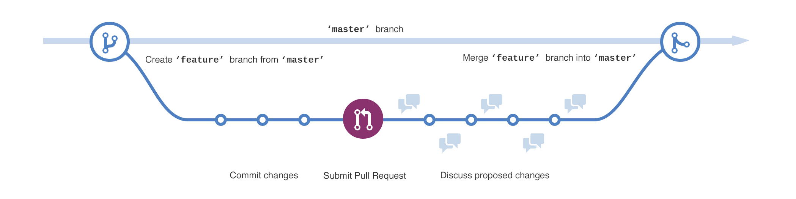
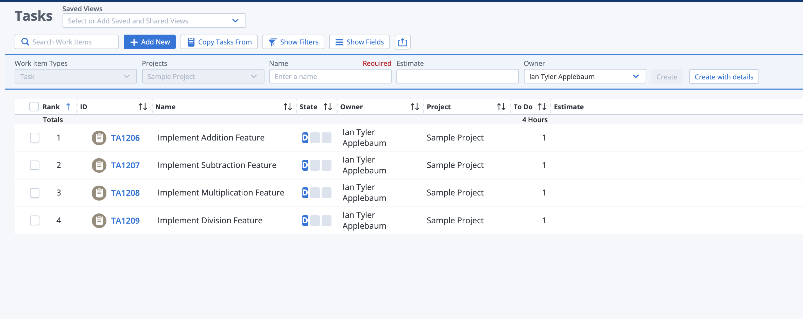
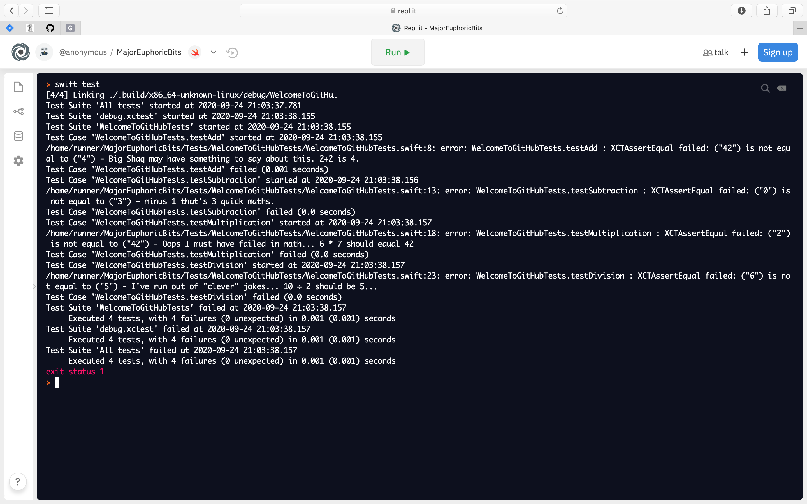

# Hello CIS Capstone!

Welcome to GitHub!
In this assignment we will be working through the bulk of the features of GitHub that you will be using throughout your project's development. 

- Pull Requests
- Code Review
- CI/CD 

This assignment will also give you early exposure to connecting your code related activities to a project management software. 

## Initial GitHub Repository Setup
I've given you Admin permission to this project. This means that you can setup protected branches. Let's make sure to setup main as a protected branch. I've provided a GitHub Action that will provide test results to each Pull Request. Make sure this is enabled. 

## Your team's task
1. Create a development branch
2. [Protect the main branch](https://docs.github.com/en/github/administering-a-repository/about-protected-branches#require-pull-request-reviews-before-merging)
3. Identify each of the issues in [`QuickMaths.swift`](Sources/WelcomeToGitHub/QuickMaths.swift)
4. Assign each team member an issue to fix.
5. Each team member will open a unique pull request to the `development` branch resolving the specified Rally issue. 
6. Finally merge the `development` branch into the `main` branch.

There are 4 pieces of code broken in [`Sources/WelcomeToGitHub/QuickMaths.swift`](Sources/WelcomeToGitHub/QuickMaths.swift) I promise it's obvious... Your team's task is to open a pull request fixing each feature! Your team should follow this process:

For this assignment we have 4 features on our hypothical Rally project. Since the main branch is protected you will need to merge your feature changes to the development branch first. Then when all the tests pass, merge development into main. 

### Brief introduction to working with a project management tool

There are many project management tools out there. Rally, Jira, and Trello are among this crowd. For this hypothetical scenario we will have a fake Rally project. In this project let's say we have a user Story "Math Feature" with the following tasks:

You are to hypothetically close these Rally tasks with Pull Requests upon completion. (1 pull request per task.) **We will not actually be interacting with Rally or any project management tools for this assignment this is just a hypothetical** 

## Swift Code
Since not all of us have a Mac or the patience to set up the Swift compiler on Linux or Windows (yes as of [Swift 5.3](https://swift.org/blog/swift-5-3-released/) Windows is supported) Let's use the online IDE Repl.it

Everything to start with in [QuickMaths.swift](Sources/WelcomeToGitHub/QuickMaths.swift) is **broken**... There is no logic associated to the functions they just return a constant number... Obviously your team has to change this. (Hint Swift's math operators are `+` `-` `*` and `/`)

This is what Repl.it will look like when you first click the `Run` button

Notice the `XCTAssertEqual failed: ("42") is not equal to ("4") - Big Shaq may have something to say about this. 2+2 is 4.`

When you correct this function it will say:
`Test Case 'WelcomeToGitHubTests.testAdd' passed (0.0 seconds)`

